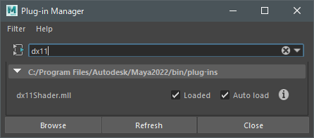
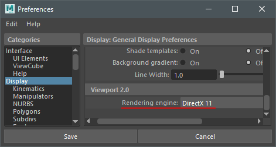
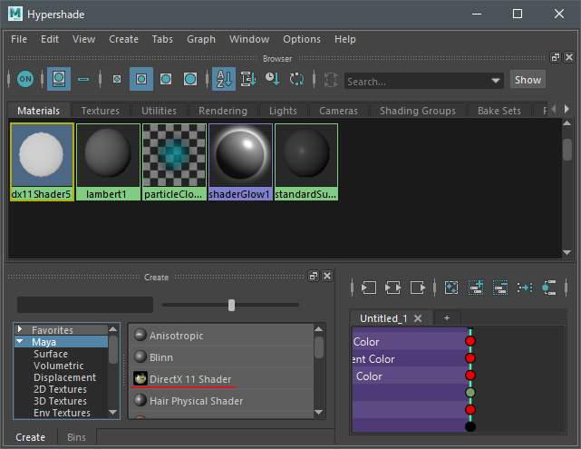
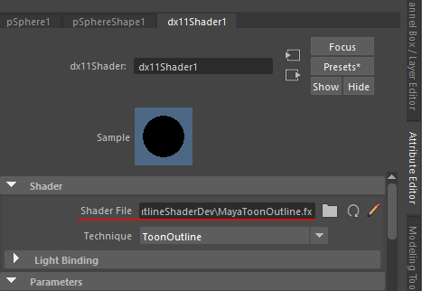
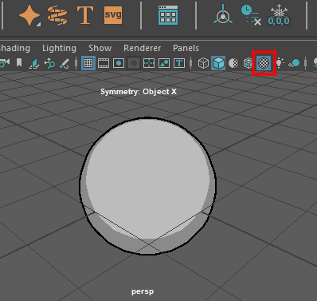

# MayaToonOutlineShader

## Realtime Toon Shader for Maya Hardware 2.0 Renderer

This is a toon shader for Maya Hardware 2.0 Renderer that implements a feature commonly used in game engines.

This shader is useful for previewing a model without exporting it to a game engine.


Download: <https://kamone416.gumroad.com/l/hnddn>

twitter: <https://twitter.com/kamone416>

## Usage

1. Enable the `dx11Shader.mll` plugin.



2. Set the rendering engine to DirextX11.

```
Preferences Window: Display > Viewport 2.0 > Rendering engine
```


3. Save the preferences and restart MAYA.

4. Create `DirectX 11 Shader` material.

```
Hypershade Window: Create > Materials > DirextX 11 Shader
```



5. Open the material's attributes and change the shader file to the `MayaToonOutline.fx` file you downloaded.




6. Apply the material to the object.
7. Enable `Textured` for a real-time preview.



## Parameters

### Shader

| Parameters  | Description                                                                                        |
| ----------- | -------------------------------------------------------------------------------------------------- |
| Shader File | Select the MayaToonOutline.fx file.                                                             |
| Technique   | `ToonOutline`: Toon shading and Outline.<br>`Toon`: Toon shading only.<br>`Outline`: Outline only. |

### Lighting

| Parameters            | Description                                                                                                                                                                                                 |
| --------------------- | ----------------------------------------------------------------------------------------------------------------------------------------------------------------------------------------------------------- |
| Linear Space Lighting | Disable this option to refrain from correcting gamma in the textures. Enabling this option assumes that the textures have gamma applied and therefore removes this gamma and re-applies it later on.        |
| Shadows               | Select this option to enable shadow casting.                                                                                                                                                                |
| Shadow Strength       | Use this slider to control the intensity of the shadows.                                                                                                                                                    |
| Shadow Bias           | Sometimes, real-time shadows can cause artifacts on your objects caused by limited precision in the shadow map or differences in scene scale. Use this attribute to remove shadow artifacts on your object. |

### Transparent

Transparency will only work with the `Toon` technique.

| Parameters     | Description                                                                                 |
| -------------- | ------------------------------------------------------------------------------------------- |
| Opacity Map UV | Select the UV for the Opacity Map. If you don't want to use the Opacity Map, select `None`. |
| Opacity Map    | Specifies the Opacity Map Texture.                                                          |
| Opacity        | Global opacity.                                                                             |

### Color

#### BaseColor

| Parameters        | Description                                                                                       |
| ----------------- | ------------------------------------------------------------------------------------------------- |
| Base Color        | Base Color.                                                                                       |
| Base Color Map UV | Select the UV for the Base Color Map. If you don't want to use the Base Color Map, select `None`. |
| Base Color Map    | Specifies the Base Color Map Texture.                                                             |

#### Grade Map

A Grade Map is a texture or vertex color used to control shadows.
Black areas will always be in shadow.

| Parameters             | Description                                                                             |
| ---------------------- | --------------------------------------------------------------------------------------- |
| Grade Map UV           | Select the UV for the Grade Map. If you don't want to use the Grade Map, select `None`. |
| Grade Map              | Specifies the Grade Map Texture.                                                        |
| Grade Map Vertex Color | Select a vertex color channel to use as the Grade Map.                                  |
| Grade Map Level        | Use this slider to control the intensity of the Grade Map.                              |

#### Shadow Color

| Parameters          | Description                                                                                                                                                                       |
| ------------------- | --------------------------------------------------------------------------------------------------------------------------------------------------------------------------------- |
| Shadow Color Map UV | Select the UV for the Shadow Color Map. If you don't want to use the Shadow Color Map, select `None`.                                                                             |
| Shadow Color Map    | Specifies the Shadow Color Map Texture.                                                                                                                                           |
| Shadow 1 Color      | Sets the color of the first layer of shadow.<br>This color will be multiplied by `Shadow Color Map`.<br>If `Shadow Color Map` is not set, it will be multiplied by `Base Color`.  |
| Shadow 1 Step       | Sets the boundary between the `Base Color` and the `Shadow 1 Color`.                                                                                                              |
| Shadow 1 Feather    | Feathers the boundary between the `Base Color` and the `Shadow 1 Color`.                                                                                                          |
| Shadow 2 Color      | Sets the color of the second layer of shadow.<br>This color will be multiplied by `Shadow Color Map`.<br>If `Shadow Color Map` is not set, it will be multiplied by `Base Color`. |
| Shadow 2 Step       | Sets the boundary between the `Shadow 1 Color` and the `Shadow 2 Color`.                                                                                                          |
| Shadow 2 Feather    | Feathers the boundary between the `Shadow 1 Color` and the `Shadow 2 Color`.                                                                                                      |

### Speclar

| Parameters      | Description                                                                                 |
| --------------- | ------------------------------------------------------------------------------------------- |
| Speclar Color   | Specifies the color of the speclar.                                                         |
| Speclar Map UV  | Select the UV for the Speclar Map. If you don't want to use the Speclar Map, select `None`. |
| Speclar Map     | Specifies the Speclar Map Texture.                                                          |
| Speclar Step    | Specifies the intensity of the speclar. Speclar.                                            |
| Speclar Feather | Specifies the smoothness of the speclar.                                                    |

### RimLight

| Parameters             | Description                                                             |
| ---------------------- | ----------------------------------------------------------------------- |
| Rim Light Color        | Specifies the color of the rim light.                                   |
| Rim Light Step         | Specifies the intensity of the rim light.                               |
| Rim Light Feather      | Specifies the smoothness of the rim light.                              |
| Light Direction Effect | Specifies how much the rim light will be shifted toward the main light. |
| Invert Light Direction | Reverses the effect of the main light.                                  |

### Outline

| Parameters           | Description                                                                                                                                      |
| -------------------- | ------------------------------------------------------------------------------------------------------------------------------------------------ |
| Outline Width        | Specifies the width of the outline.                                                                                                              |
| Outline Width Map    | Select a vertex color channel to use for adjusting the width of the outline.<br>The width of the outline will be multiplied by the vertex color. |
| Outline Color Map UV | Select the UV for the Outline Color Map. If you don't want to use the Outline Color Map, select `None`.                                          |
| Outline Color Map    | Specifies the Outline Color Map.                                                                                                                 |
| Outline Color        | Specifies the color of the outline.                                                                                                              |
| Z Offset             | Offset the outline in the Z direction by the specified value.                                                                                    |
| Z Offset Map         | Select a vertex color channel to use for adjusting the `Z Offset`.<br>The `Z Offset` will be multiplied by the vertex color.                     |

### Debug

| Debug Parameters        | Description                                                 |
| ----------------------- | ----------------------------------------------------------- |
| None                    | No Debugging.                                               |
| HalfLambert             | Shading with HalfLambert.                                   |
| GradeMap                | Display the grade map.                                      |
| HalfLambert \* GradeMap | Display the result of HalfLambert \* GradeMap.              |
| Normal XYZ              | Display the normal value.                                   |
| Normal X                | Display the normal X value.                                 |
| Normal Y                | Display the normal Y value.                                 |
| Normal Z                | Display the normal Z value.                                 |
| VertexColor1 RGB        | Display the vertex color of ColorSet1.                      |
| VertexColor1 Red        | Display the red channel of the vertex color of ColorSet1.   |
| VertexColor1 Green      | Display the blue channel of the vertex color of ColorSet1.  |
| VertexColor1 Blue       | Display the green channel of the vertex color of ColorSet1. |
| VertexColor1 Alpha      | Display the alpha channel of the vertex color of ColorSet1. |
| VertexColor2 RGB        | Display the vertex color of ColorSet2.                      |
| VertexColor2 Red        | Display the red channel of the vertex color of ColorSet2.   |
| VertexColor2 Green      | Display the blue channel of the vertex color of ColorSet2.  |
| VertexColor2 Blue       | Display the green channel of the vertex color of ColorSet2. |
| VertexColor2 Alpha      | Display the alpha channel of the vertex color of ColorSet2. |
