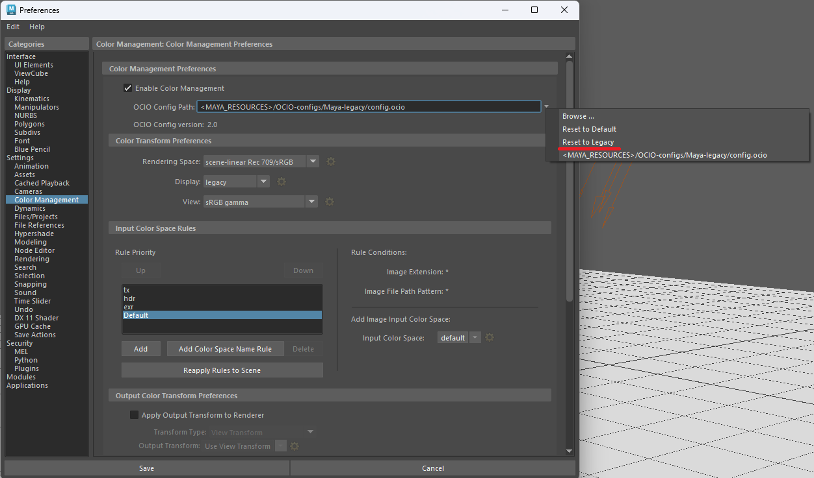

# MayaToonOutlineShader


## Realtime Toon Shader for Maya Hardware 2.0 Renderer

Mayaビューポート2.0(Hardware 2.0 Renderer)用のリアルタイムトゥーンシェーダーです。
Unityなどゲームエンジンで使われているトゥーンシェーダーの基本的な機能を実装しています。
ゲームエンジンへの出力前の確認や、法線編集の確認に便利です。

※ Arnoldによるレンダリングはサポートしていません。

### 機能

- 背面法によるアウトラインの描画
- 2階調の影
- 影用テクスチャー
- グレードマップ（グレースケールによる影のコントロール）
- リムライト

Download: <https://kamone416.gumroad.com/l/hnddn>

twitter: <https://twitter.com/kamone416>

## インストール

1. `dx11Shader.mll` プラグインを有効化する


2. レンダリングエンジンを`DirextX11`に設定する.

```
Preferences Window: Display > Viewport 2.0 > Rendering engine
```


3. カラー管理プリファレンスを旧式に設定する



4. 設定を保存してMayaを再起動する
5. マテリアル`DirectX 11 Shader`を作成する

```
Hypershade Window: Create > Materials > DirextX 11 Shader
```


6. マテリアルのアトリビュートを開いて、ダウンロードした`MayaToonOutline.fx`を読み込む


7. メッシュにマテリアルを割り当てる
8. ツールバーから`Textured`を有効にする


## パラメーター

### Shader

| Parameters | Description |
| --- | --- |
| Shader File | ダウンロードした`MayaToonOutline.fx`を選択してください。|
| Technique | `ToonOutline`: トゥーンシェーディングとアウトライン<br>`Toon`: トゥーンシェーディングのみ<br>`Outline`: アウトラインのみ |

### Lighting

| Parameters | Description |
| --- | --- |
| Linear Space Lighting | Disable this option to refrain from correcting gamma in the textures. Enabling this option assumes that the textures have gamma applied and therefore removes this gamma and re-applies it later on. |
| Shadows | 有効にすると影を描画します。 |
| Shadow Strength | 影の強さを指定します。 |
| Shadow Bias | 影の位置を調整します。影のアーティファクトが発生した場合に調整してください。 |
| Shadow Filter Width | 影の境界をぼかします。 |
| Shadow Filter Count | 影を描画する回数を指定します。描画する回数が多いと影が滑らかになります。 |

### Transparent

半透明は`Toon`のみサポートしています。

| Parameters | Description |
| --- | --- |
| Opacity Map UV | Opacity Mapに使うUVを選択してください。 Opacity Mapを使わない場合は`None`を選択します。 |
| Opacity Map | Opacity Mapに使うテクスチャーを指定してください。 |
| Opacity | マテリアル全体の透明度を指定します。 |

### Color

#### BaseColor

マテリアルの基本色を設定します。

| Parameters | Description |
| --- | --- |
| Base Color | Base Color. |
| Base Color Map UV | Base Color Mapに使うUVを選択してください。 Base Color Mapを使わない場合は`None`を選択します。  |
| Base Color Map | Base Color Mapに使うテクスチャーを指定してください。 |

#### Detail Color Map

デカールなど基本色の上にテクスチャを表示したい場合に設定してください。


| Parameters | Description |
| --- | --- |
| Detail Color Map UV | Detail Color Mapに使うUVを選択してください。 Detail Color Mapを使わない場合は`None`を選択します。 |
| Detail Color Map | Detail Color Mapに使うテクスチャーを指定してください。 |

#### Grade Map

Grade Mapはテクスチャー、頂点カラーを使って影の強さをコントロールします。
Grade Mapが黒の場合、その部分は常に影になります。


| Parameters | Description |
| --- | --- |
| Grade Map UV | Grade Mapに使うUVを選択してください。 Grade Mapを使わない場合は`None`を選択します。 |
| Grade Map | Grade Mapに使うテクスチャーを指定してください。 |
| Grade Map Vertex Color | Grade Mapに頂点カラーを選択してください。 |
| Grade Map Level | Grade Mapの影響の強さを調整します。 |

#### Shadow Color

影の色を指定します。

Shadow Color Mapを指定すると、影の色をテクスチャーで指定することができます。

| Parameters | Description |
| --- | --- |
| Shadow Color Map UV | Shadow Color Mapに使うUVを選択してください。 Shadow Color Mapを使わない場合は`None`を選択します。|
| Shadow Color Map | Shadow Color Mapに使うテクスチャーを指定してください。 |
| Shadow 1 Color | 最初の影の色を指定します。<br>`Shadow Color Map`が設定されている場合、`Shadow Color Map`の色に乗算します。<br>`Shadow Color Map`が設定されていない場合、`Base Color`の色に乗算します。|
| Shadow 1 Step | `Shadow 1 Color`の影響範囲を指定します。 |
| Shadow 1 Feather | `Base Color`と`Shadow 1 Color`の境界をぼかします。 |
| Shadow 2 Color | 2番目の影の色を指定します。<br>`Shadow Color Map`が設定されている場合、`Shadow Color Map`の色に乗算します。<br>`Shadow Color Map`が設定されていない場合、`Base Color`の色に乗算します。 |
| Shadow 2 Step | `Shadow 2 Color`の影響範囲を指定します |
| Shadow 2 Feather |  `Shadow 1 Color`と`Shadow 2 Color`の境界をぼかします。 |

### Speclar

| Parameters | Description |
| --- | --- |
| Speclar Color | 光沢の色を指定します。 |
| Speclar Map UV | Speclar Mapに使うUVを選択してください。 Speclar Mapを使わない場合は`None`を選択します。 |
| Speclar Map | Speclar Mapに使うテクスチャーを指定してください。 |
| Speclar Step | 光沢の強さを指定します。 |
| Speclar Feather | 光沢と`Base Color`の境界をぼかします。 |

### RimLight

| Parameters | Description |
| --- | --- |
| Rim Light Color | リムライトの色を指定します。 |
| Rim Light Step | リムライトの強さを指定します。 |
| Rim Light Feather | リムライトの境界をぼかします。 |
| Light Direction Effect | リムライトを光源方向にずらします。 |
| Invert Light Direction | Light Direction Effectの影響を反転します。 |

### Outline

| Parameters | Description |
| --- | --- |
| Outline Width | アウトラインの太さを指定します。 |
| Outline Width Map | アウトラインの太さを頂点カラーで調整します。|
| Outline Color Map UV | Outline Color Mapに使うUVを選択してください。Outline Color Mapを使わない場合は`None`を選択します。 |
| Outline Color Map | Outline Color Mapに使うテクスチャーを指定してください。 |
| Outline Color | アウトラインの色を指定します。 |
| Z Offset | Offset the outline in the Z direction by the specified value. |
| Z Offset Map | Select a vertex color channel to use for adjusting the `Z Offset`.<br>The `Z Offset` will be multiplied by the vertex color. |

### Debug

| Debug Parameters        | Description                                                 |
| ----------------------- | ----------------------------------------------------------- |
| None                    | No Debugging.                                               |
| HalfLambert             | Shading with HalfLambert.                                   |
| GradeMap                | Display the grade map.                                      |
| HalfLambert \* GradeMap | Display the result of HalfLambert \* GradeMap.              |
| Normal XYZ              | Display the normal value.                                   |
| Normal X                | Display the normal X value.                                 |
| Normal Y                | Display the normal Y value.                                 |
| Normal Z                | Display the normal Z value.                                 |
| VertexColor1 RGB        | Display the vertex color of ColorSet1.                      |
| VertexColor1 Red        | Display the red channel of the vertex color of ColorSet1.   |
| VertexColor1 Green      | Display the blue channel of the vertex color of ColorSet1.  |
| VertexColor1 Blue       | Display the green channel of the vertex color of ColorSet1. |
| VertexColor1 Alpha      | Display the alpha channel of the vertex color of ColorSet1. |
| VertexColor2 RGB        | Display the vertex color of ColorSet2.                      |
| VertexColor2 Red        | Display the red channel of the vertex color of ColorSet2.   |
| VertexColor2 Green      | Display the blue channel of the vertex color of ColorSet2.  |
| VertexColor2 Blue       | Display the green channel of the vertex color of ColorSet2. |
| VertexColor2 Alpha      | Display the alpha channel of the vertex color of ColorSet2. |
